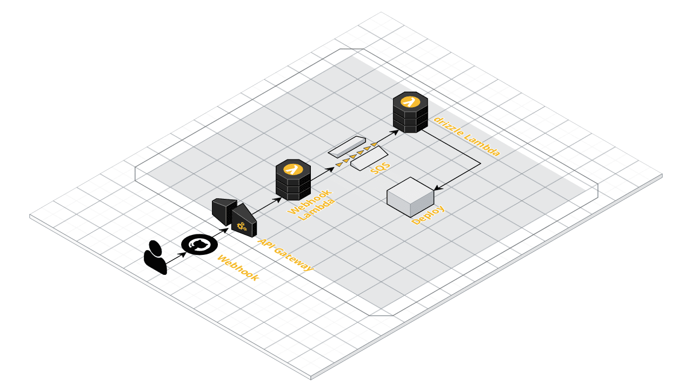

# Drizzle
Experimental serverless CI/CD pipeline on AWS.

Part of [Drizzle - Serverless CI/CD Pipeline With AWS Lambda](https://www.uphill.dev/blog/drizzle-ci-cd-pipeline/) blog post on [uphill.dev](https://www.uphill.dev).

## How to run
See the [CDK Infrastructure](https://github.com/hill-daniel/drizzle-infrastructure) project for detailed instruction.
